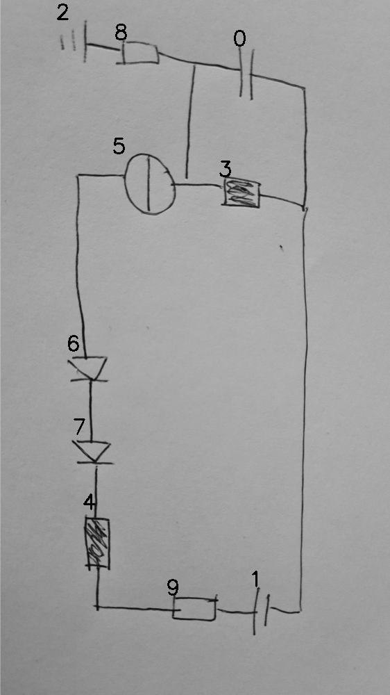

# EVAL 07_00_000_nflip_aug

always \<left right> or \<top bottom>

## START

    0 0 1 1 2 2 3 3 4 4 5 5 6 6 7 7 8 8 9 9 // cs
    0 0 0 0 0 1 0 0 0 0 0 0 0 0 0 0 1 0 0 0 // 2 8
    1 0 0 0 0 0 1 0 0 0 0 1 0 0 0 0 0 1 0 0 // 0 3 5 8
    0 0 0 0 0 0 0 0 0 0 1 0 1 0 0 0 0 0 0 0 // 5 6
    0 0 0 0 0 0 0 0 0 0 0 0 0 1 1 0 0 0 0 0 // 6 7
    0 0 0 0 0 0 0 0 1 0 0 0 0 0 0 1 0 0 0 0 // 4 7
    0 0 0 0 0 0 0 0 0 1 0 0 0 0 0 0 0 0 1 0 // 4 9
    0 0 1 0 0 0 0 0 0 0 0 0 0 0 0 0 0 0 0 1 // 9 1
    0 1 0 1 0 0 0 1 0 0 0 0 0 0 0 0 0 0 0 0 // 0 1 3

## END
