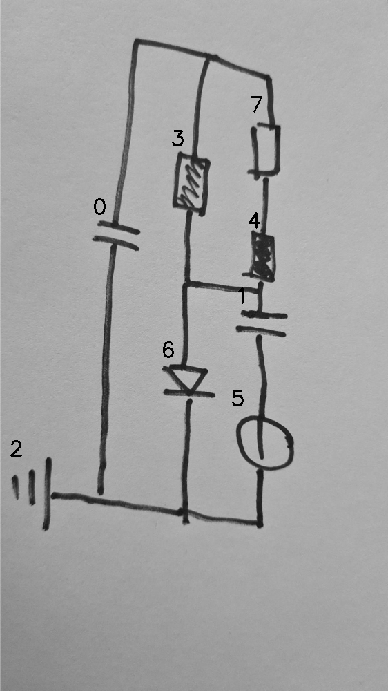

# 07_01_000_nflip_aug_eval.png

always \<left right> or \<top bottom>

## START

	0 0 1 1 2 2 3 3 4 4 5 5 6 6 7 7
	1 0 0 0 0 0 1 0 0 0 0 0 0 0 1 0 // 0t,3t,7t
    0 0 0 0 0 0 0 0 1 0 0 0 0 0 0 1 // 4t,7b
    0 0 1 0 0 0 0 1 0 1 0 0 1 0 0 0 // 3b,6t,4b,1t
    0 1 0 0 0 1 0 0 0 0 0 1 0 1 0 0 // 0b,2r,6b,5b

## END

            
