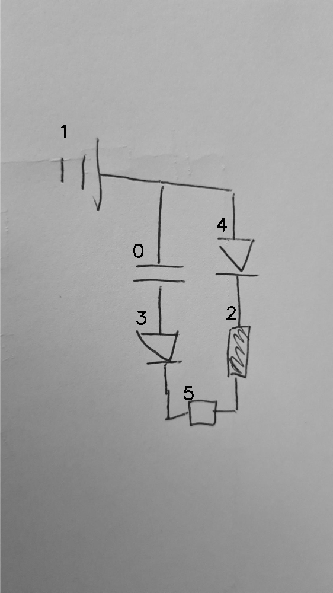

# 07_02_000_nflip_aug_eval.png

always \<left right> or \<top bottom>

## START

	0 0 1 1 2 2 3 3 4 4 5 5
	1 0 0 1 0 0 0 0 1 0 0 0 // 1r,0t,4t
    0 1 0 0 0 0 1 0 0 0 0 0 // 0b,3t
    0 0 0 0 0 0 0 1 0 0 1 0 // 3b,5l
    0 0 0 0 0 1 0 0 0 0 0 1 // 5r,2b
    0 0 0 0 1 0 0 0 0 1 0 0 // 4b,2t

## END

            
