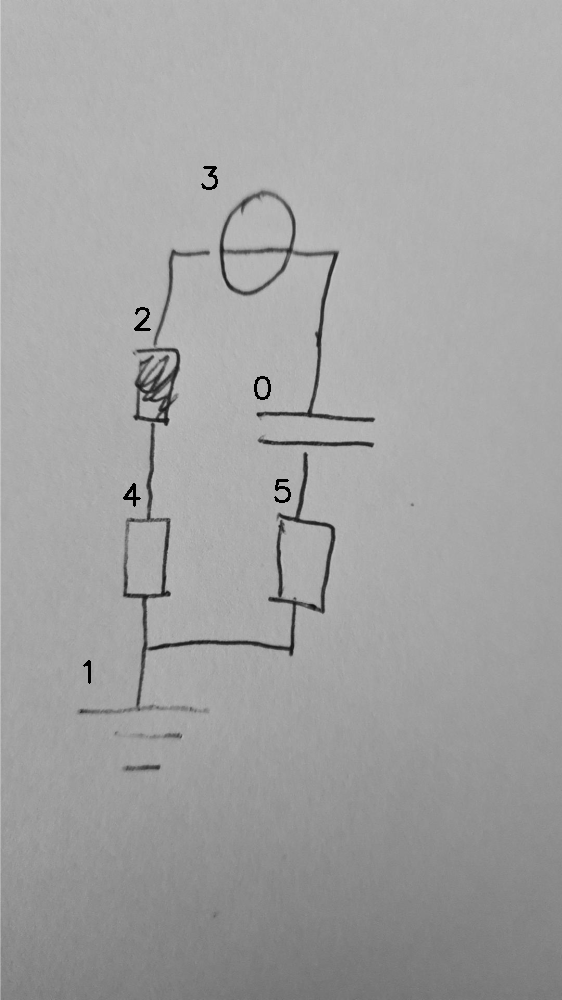

# 07_04_000_nflip_aug_eval.png

always \<left right> or \<top bottom>

## START

	0 0 1 1 2 2 3 3 4 4 5 5
	0 0 1 0 0 0 0 0 0 1 0 1 // 1t,4b,5b
0 0 0 0 0 1 0 0 1 0 0 0 // 4t,2b
0 0 0 0 1 0 1 0 0 0 0 0 // 2t,3l
1 0 0 0 0 0 0 1 0 0 0 0 // 3r,0t
0 1 0 0 0 0 0 0 0 0 1 0 // 0b,5t

## END

            