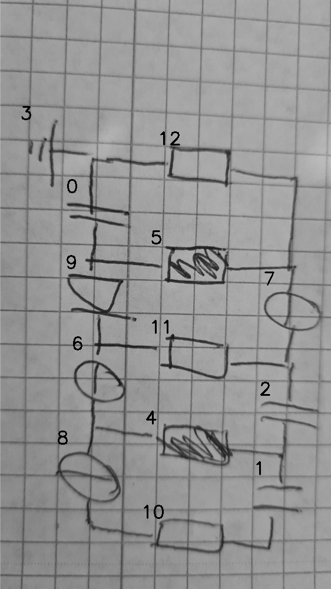

# EVAL 07_00_000_nflip_aug

always \<left right> or \<top bottom>

## START

    0 0 1 1 2 2 3 3 4 4 5 5 6 6 7 7 8 8 9 9 10 10 11 11 12 12 // cs
    1 0 0 0 0 0 0 1 0 0 0 0 0 0 0 0 0 0 0 0 0  0  0  0  1  0  // 0 3 12
    0 1 0 0 0 0 0 0 0 0 1 0 0 0 0 0 0 0 1 0 0  0  0  0  0  0  // 0 5 9
    0 0 0 0 0 0 0 0 0 0 0 0 1 0 0 0 0 0 0 1 0  0  1  0  0  0  // 6 9 11
    0 0 0 0 0 0 0 0 1 0 0 0 0 1 0 0 1 0 0 0 0  0  0  0  0  0  // 4 6 8
    0 0 0 0 0 0 0 0 0 0 0 0 0 0 0 0 0 1 0 0 1  0  0  0  0  0  // 8 10
    0 0 0 1 0 0 0 0 0 0 0 0 0 0 0 0 0 0 0 0 0  1  0  0  0  0  // 1 10
    0 0 1 0 0 1 0 0 0 1 0 0 0 0 0 0 0 0 0 0 0  0  0  0  0  0  // 1 2 4
    0 0 0 0 1 0 0 0 0 0 0 0 0 0 0 1 0 0 0 0 0  0  0  1  0  0  // 2 7 11
    0 0 0 0 0 0 0 0 0 0 0 1 0 0 1 0 0 0 0 0 0  0  0  0  0  1  // 5 7 12

## END
