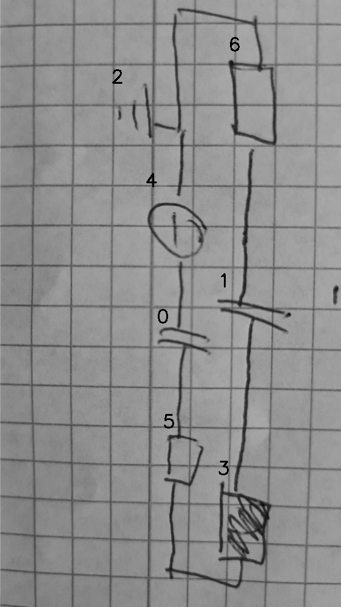

# 07_06_000_nflip_aug_eval.png

always \<left right> or \<top bottom>

## START

	0 0 1 1 2 2 3 3 4 4 5 5 6 6
	0 0 0 0 0 1 0 0 1 0 0 0 1 0 // 2r,6t,4t
1 0 0 0 0 0 0 0 0 1 0 0 0 0 // 4b,0t
0 1 0 0 0 0 0 0 0 0 1 0 0 0 // 0b,5t
0 0 0 0 0 0 0 1 0 0 0 1 0 0 // 5b,3b
0 0 0 1 0 0 1 0 0 0 0 0 0 0 // 3t,1b
0 0 1 0 0 0 0 0 0 0 0 0 0 1 // 1t,6b

## END

            