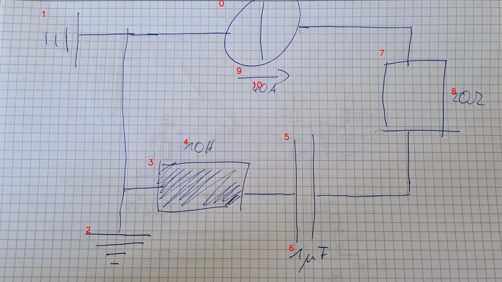

# 07_09_c_a_eval.png

always \<left right> or \<top bottom>

## START

	0 0 1 1 2 2 3 3 4 4 5 5 6 6 7 7 8 8 9 9 10 10
	1 0 0 1 1 0 1 0 0 0 0 0 0 0 0 0 0 0 0 0 0 0 // 1r,0l,2t,3l
    0 1 0 0 0 0 0 0 0 0 0 0 0 0 1 0 0 0 0 0 0 0 // 0r,7t
    0 0 0 0 0 0 0 0 0 0 0 1 0 0 0 1 0 0 0 0 0 0 // 5r,7b
    0 0 0 0 0 0 0 1 0 0 1 0 0 0 0 0 0 0 0 0 0 0 // 5l,3r

## END

            
