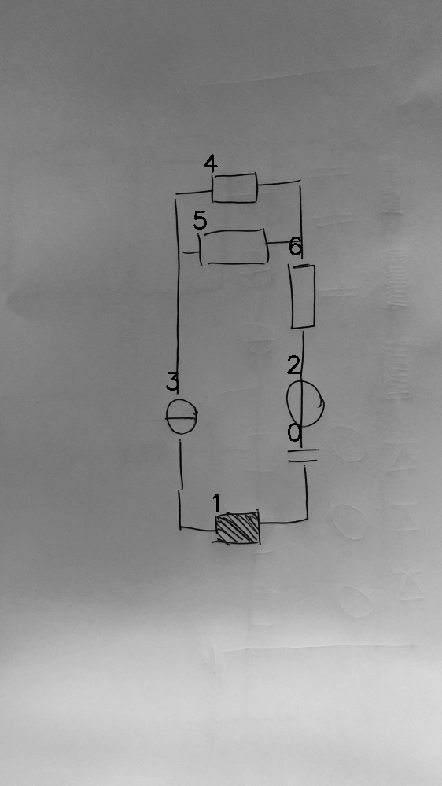

# 08_00_000_nflip_aug_eval.png

always \<left right> or \<top bottom>

## START

	0 0 1 1 2 2 3 3 4 4 5 5 6 6
	0 0 0 0 0 0 1 0 1 0 1 0 0 0 // 4l,5l,3t
0 0 1 0 0 0 0 1 0 0 0 0 0 0 // 3b,1l
0 1 0 1 0 0 0 0 0 0 0 0 0 0 // 1r,0b
1 0 0 0 0 1 0 0 0 0 0 0 0 0 // 0t,2b
0 0 0 0 1 0 0 0 0 0 0 0 0 1 // 2t,6b
0 0 0 0 0 0 0 0 0 1 0 1 1 0 // 6t,5r,4r

## END

            