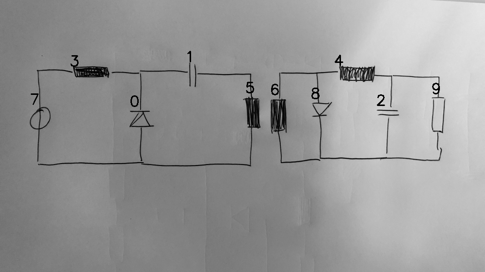

# 08_02_000_nflip_aug_eval.png

always \<left right> or \<top bottom>

## START

	0 0 1 1 2 2 3 3 4 4 5 5 6 6 7 7 8 8 9 9
	0 0 0 0 0 0 1 0 0 0 0 0 0 0 1 0 0 0 0 0 // 7t,3l
1 0 1 0 0 0 0 1 0 0 0 0 0 0 0 0 0 0 0 0 // 3r,0t,1l
0 0 0 1 0 0 0 0 0 0 1 0 0 0 0 0 0 0 0 0 // 1r,5t
0 1 0 0 0 0 0 0 0 0 0 1 0 0 0 1 0 0 0 0 // 7b,0b,5b
0 0 0 0 0 0 0 0 1 0 0 0 1 0 0 0 1 0 0 0 // 6t,8t,4l
0 0 0 0 1 0 0 0 0 1 0 0 0 0 0 0 0 0 1 0 // 4r,2t,9t
0 0 0 0 0 1 0 0 0 0 0 0 0 1 0 0 0 1 0 1 // 6b,8b,2b,9b

## END

            