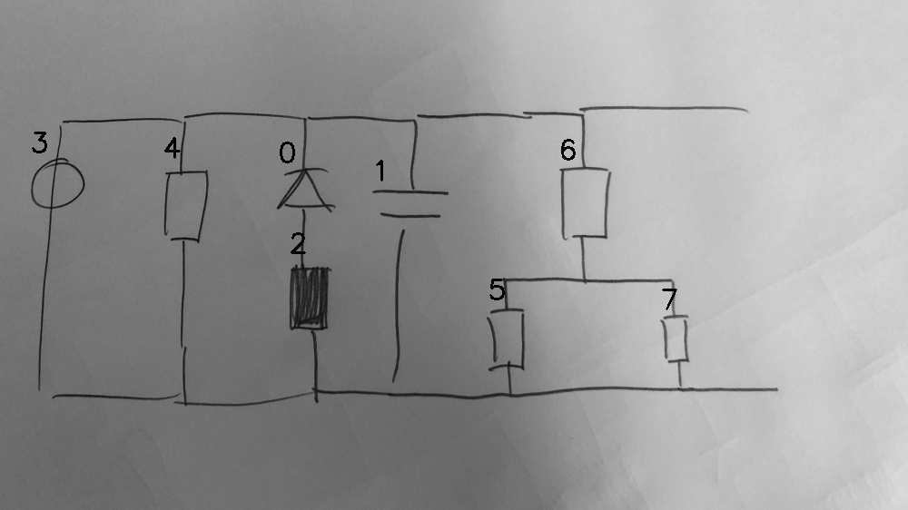

# 08_03_000_nflip_aug_eval.png

always \<left right> or \<top bottom>

## START

	0 0 1 1 2 2 3 3 4 4 5 5 6 6 7 7
	1 0 1 0 0 0 1 0 1 0 0 0 1 0 0 0 // 3t,4t,0t,1t,6t
0 1 0 0 1 0 0 0 0 0 0 0 0 0 0 0 // 0b,2t
0 0 0 0 0 0 0 0 0 0 1 0 0 1 1 0 // 6b,5t,7t
0 0 0 1 0 1 0 1 0 1 0 1 0 0 0 1 // 3b,4b,2b,1b,5b,7b

## END

            