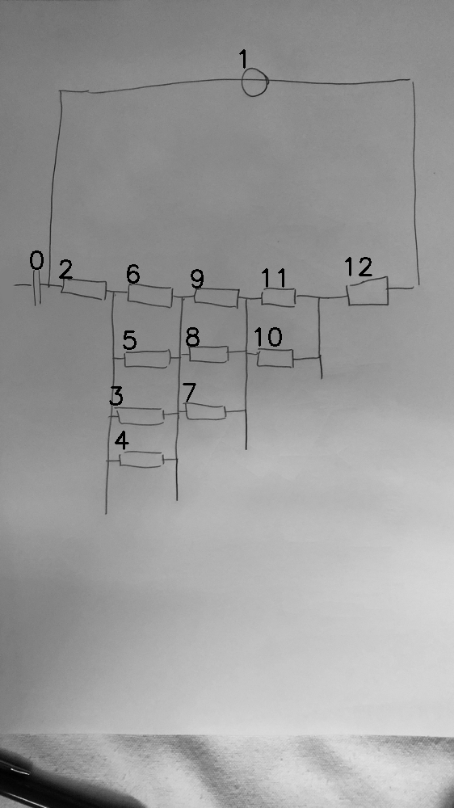

# 08_04_000_nflip_aug_eval.png

always \<left right> or \<top bottom>

## START

	0 0 1 1 2 2 3 3 4 4 5 5 6 6 7 7 8 8 9 9 10 10 11 11 12 12
	0 1 1 0 1 0 0 0 0 0 0 0 0 0 0 0 0 0 0 0 0 0 0 0 0 0 // 0r,1l,2l
    0 0 0 0 0 1 1 0 1 0 1 0 1 0 0 0 0 0 0 0 0 0 0 0 0 0 // 2r,6l,5l,3l,4l
    0 0 0 0 0 0 0 1 0 1 0 1 0 1 1 0 1 0 1 0 0 0 0 0 0 0 // 6r,5r,3r,4r,9l,8l,7l
    0 0 0 0 0 0 0 0 0 0 0 0 0 0 0 1 0 1 0 1 1 0 1 0 0 0 // 11l,10l,9r,8r,7r
    0 0 0 0 0 0 0 0 0 0 0 0 0 0 0 0 0 0 0 0 0 1 0 1 1 0 // 11r,10r,12l
    0 0 0 1 0 0 0 0 0 0 0 0 0 0 0 0 0 0 0 0 0 0 0 0 0 1 // 1r,12r

## END
