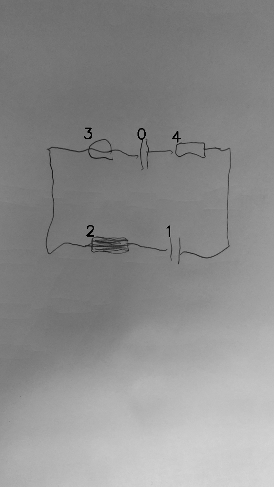

# 08_06_000_nflip_aug_eval.png

always \<left right> or \<top bottom>

## START

	0 0 1 1 2 2 3 3 4 4
	0 0 0 0 1 0 1 0 0 0 // 3l,2l
1 0 0 0 0 0 0 1 0 0 // 3r,0l
0 1 0 0 0 0 0 0 1 0 // 0r,4l
0 0 0 1 0 0 0 0 0 1 // 4r,1r
0 0 1 0 0 1 0 0 0 0 // 2r,1l

## END

            