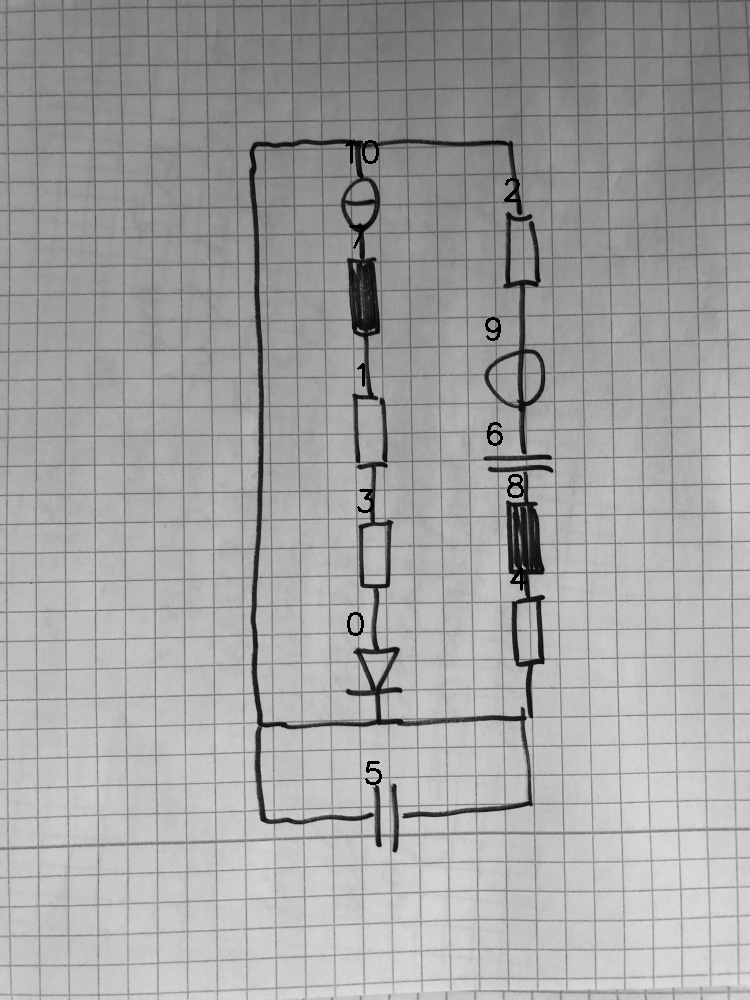

# 08_08_000_nflip_aug_eval.png

always \<left right> or \<top bottom>

## START

	0 0 1 1 2 2 3 3 4 4 5 5 6 6 7 7 8 8 9 9 10 10
	0 1 0 0 1 0 0 0 0 1 1 1 0 0 0 0 0 0 0 0 1 0 // 10t,2t,5l,5r,0b,4b
    0 0 0 0 0 0 0 0 0 0 0 0 0 0 1 0 0 0 0 0 0 1 // 10b,7t
    0 0 1 0 0 0 0 0 0 0 0 0 0 0 0 1 0 0 0 0 0 0 // 7b,1t
    0 0 0 1 0 0 1 0 0 0 0 0 0 0 0 0 0 0 0 0 0 0 // 1b,3t
    1 0 0 0 0 0 0 1 0 0 0 0 0 0 0 0 0 0 0 0 0 0 // 3b,0t
    0 0 0 0 0 1 0 0 0 0 0 0 0 0 0 0 0 0 1 0 0 0 // 2b,9t
    0 0 0 0 0 0 0 0 0 0 0 0 1 0 0 0 0 0 0 1 0 0 // 9b,6t
    0 0 0 0 0 0 0 0 0 0 0 0 0 1 0 0 1 0 0 0 0 0 // 6b,8t
    0 0 0 0 0 0 0 0 1 0 0 0 0 0 0 0 0 1 0 0 0 0 // 8b,4t

## END
