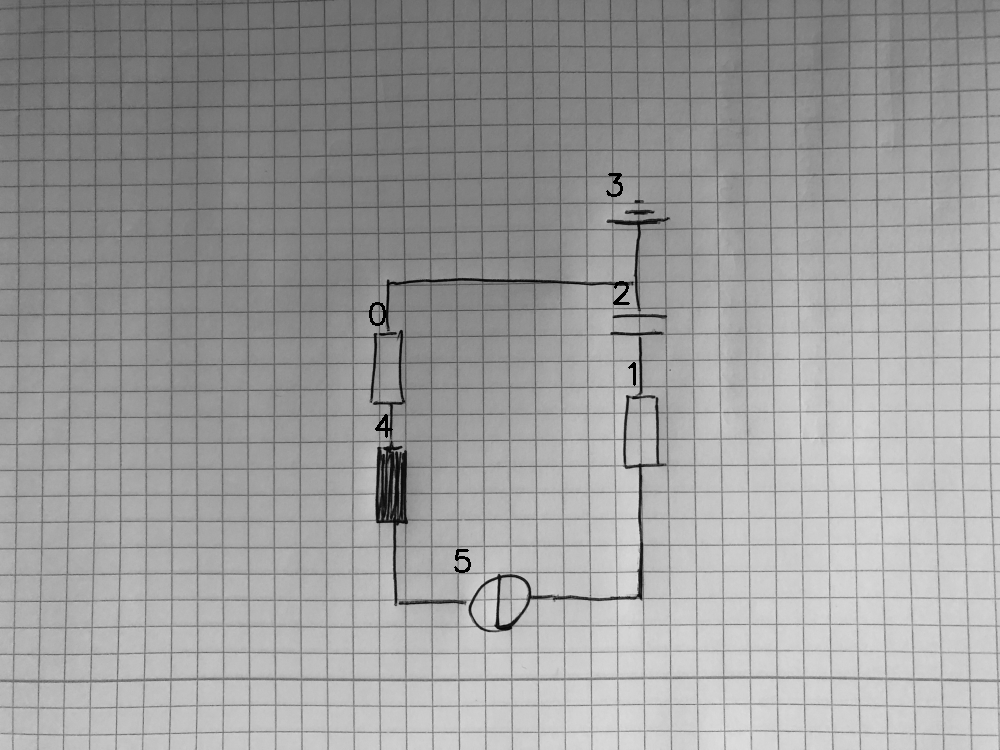

# 08_09_000_nflip_aug_eval.png

always \<left right> or \<top bottom>

## START

	0 0 1 1 2 2 3 3 4 4 5 5
	1 0 0 0 1 0 0 1 0 0 0 0 // 0t,2t,3b
    0 1 0 0 0 0 0 0 1 0 0 0 // 0b,4t
    0 0 0 0 0 0 0 0 0 1 1 0 // 4b,5l
    0 0 0 1 0 0 0 0 0 0 0 1 // 5r,1b
    0 0 1 0 0 1 0 0 0 0 0 0 // 1t,2b

## END
