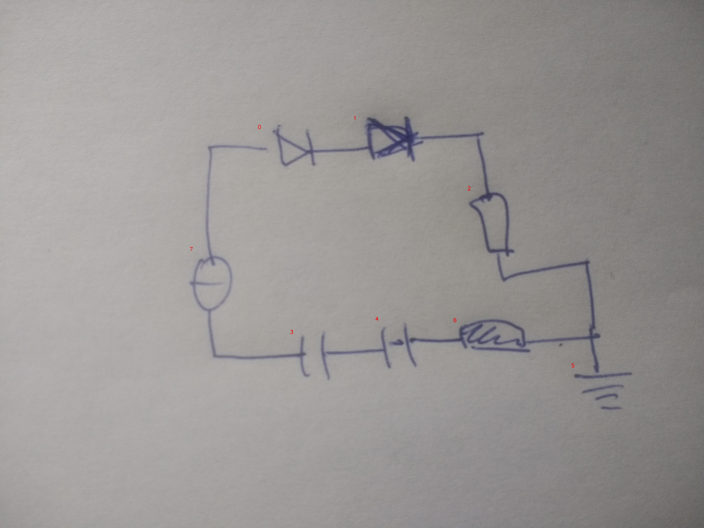

# 20_03_eval.jpg

always \<left right> or \<top bottom>

## START

	0 0 1 1 2 2 3 3 4 4 5 5 6 6 7 7
	1 0 0 0 0 0 0 0 0 0 0 0 0 0 1 0 // 7t,0l
0 1 1 0 0 0 0 0 0 0 0 0 0 0 0 0 // 0r,1l
0 0 0 1 1 0 0 0 0 0 0 0 0 0 0 0 // 1r,2t
0 0 0 0 0 1 0 0 0 0 1 0 0 1 0 0 // 2b,5t,6r
0 0 0 0 0 0 0 0 0 1 0 0 1 0 0 0 // 6l,4r
0 0 0 0 0 0 0 1 1 0 0 0 0 0 0 0 // 4l,3r
0 0 0 0 0 0 1 0 0 0 0 0 0 0 0 1 // 3l,7b

## END

            