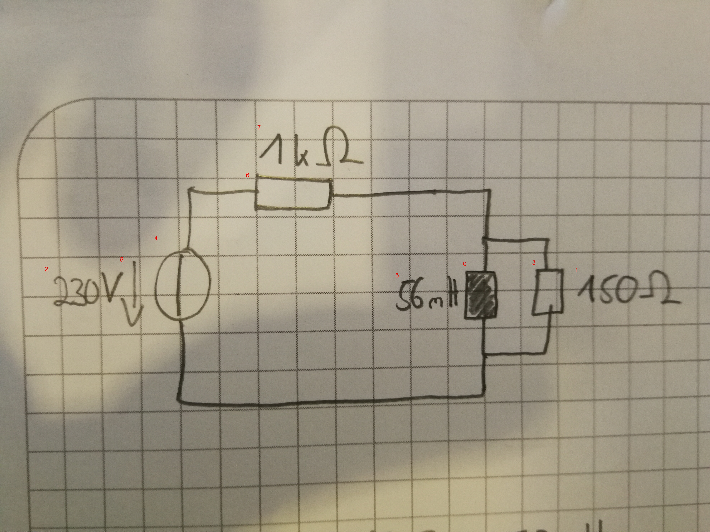

# 21_01_c_a_eval.jpg

always \<left right> or \<top bottom>

## START

	0 0 1 1 2 2 3 3 4 4 5 5 6 6 7 7 8 8
	0 0 0 0 0 0 0 0 1 0 0 0 1 0 0 0 0 0 // 4t,6l
1 0 0 0 0 0 1 0 0 0 0 0 0 1 0 0 0 0 // 6r,0t,3t
0 1 0 0 0 0 0 1 0 1 0 0 0 0 0 0 0 0 // 4b,0b,3b

## END

            