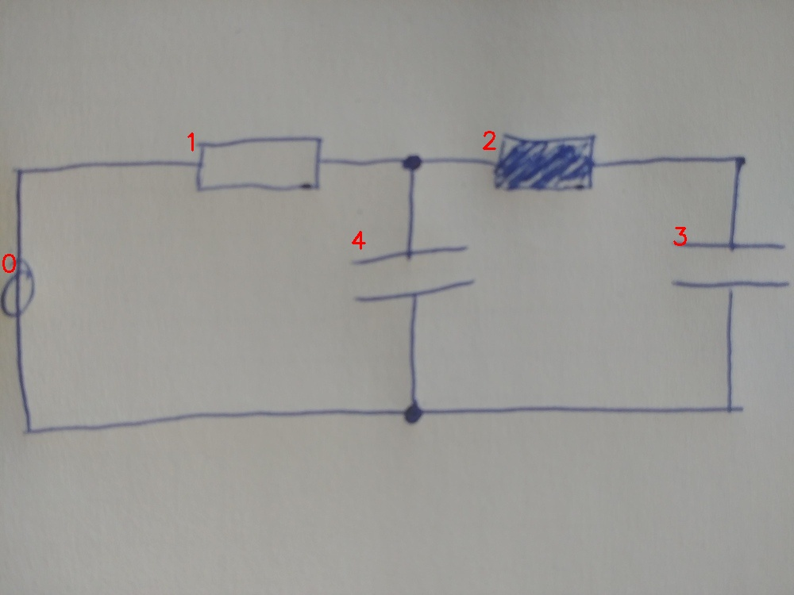

# 22_00_eval.jpg

always \<left right> or \<top bottom>

## START

	0 0 1 1 2 2 3 3 4 4
	1 0 1 0 0 0 0 0 0 0 // 0t,1l
0 0 0 1 1 0 0 0 1 0 // 1r,4t,2l
0 0 0 0 0 1 1 0 0 0 // 2r,3t
0 1 0 0 0 0 0 1 0 1 // 3b,4b,0b

## END

            