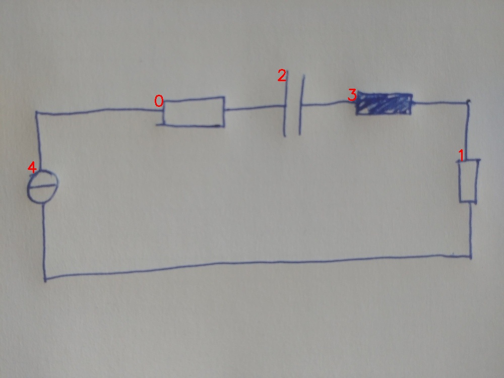

# 22_01_eval.jpg

always \<left right> or \<top bottom>

## START

	0 0 1 1 2 2 3 3 4 4
	1 0 0 0 0 0 0 0 1 0 // 4t,0l
0 1 0 0 1 0 0 0 0 0 // 0r,2l
0 0 0 0 0 1 1 0 0 0 // 2r,3l
0 0 1 0 0 0 0 1 0 0 // 3r,1t
0 0 0 1 0 0 0 0 0 1 // 1b,4b

## END

            