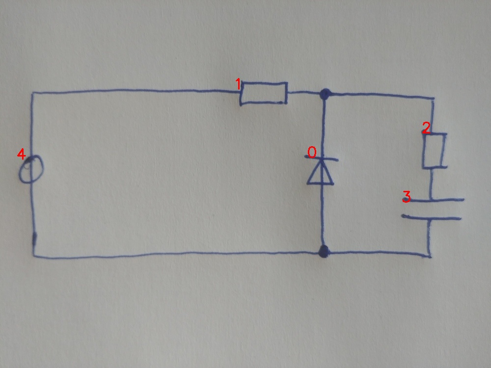

# 22_02_eval.jpg

always \<left right> or \<top bottom>

## START

	0 0 1 1 2 2 3 3 4 4
	0 0 1 0 0 0 0 0 1 0 // 4t,1l
1 0 0 1 1 0 0 0 0 0 // 1r,0t,2t
0 0 0 0 0 1 1 0 0 0 // 2b,3t
0 1 0 0 0 0 0 1 0 1 // 3b,0b,4b

## END

            