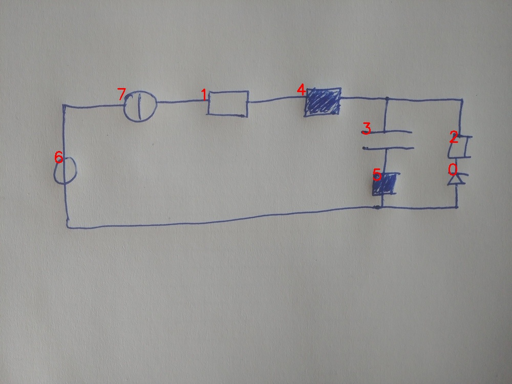

# 22_03_eval.jpg

always \<left right> or \<top bottom>

## START

	0 0 1 1 2 2 3 3 4 4 5 5 6 6 7 7
	0 0 0 0 0 0 0 0 0 0 0 0 1 0 1 0 // 6t,7l
0 0 1 0 0 0 0 0 0 0 0 0 0 0 0 1 // 7r,1l
0 0 0 1 0 0 0 0 1 0 0 0 0 0 0 0 // 1r,4l
0 0 0 0 1 0 1 0 0 1 0 0 0 0 0 0 // 4r,3t,2t
0 0 0 0 0 0 0 1 0 0 1 0 0 0 0 0 // 3b,5t
1 0 0 0 0 1 0 0 0 0 0 0 0 0 0 0 // 2b,0t
0 1 0 0 0 0 0 0 0 0 0 1 0 1 0 0 // 0b,5b,6b

## END

            