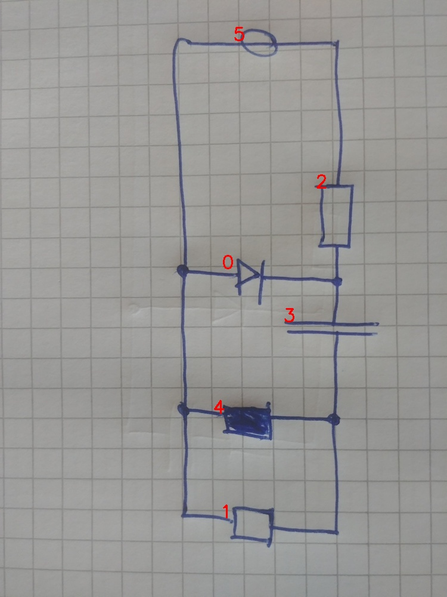

# 22_05_c_eval.jpg

always \<left right> or \<top bottom>

## START

	0 0 1 1 2 2 3 3 4 4 5 5
	0 0 0 0 1 0 0 0 0 0 0 1 // 5r,2t
0 1 0 0 0 1 1 0 0 0 0 0 // 2b,0r,3t
0 0 0 1 0 0 0 1 0 1 0 0 // 3b,4r,1r
1 0 1 0 0 0 0 0 1 0 1 0 // 1l,4l,0l,5l

## END

            