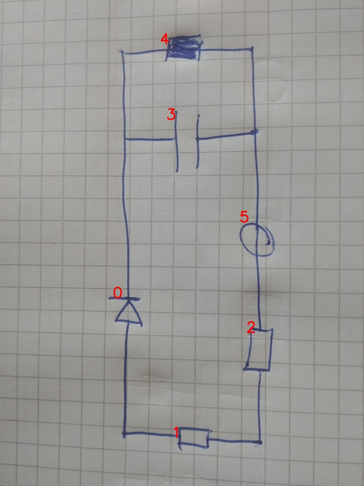

# 22_06_c_eval.jpg

always \<left right> or \<top bottom>

## START

	0 0 1 1 2 2 3 3 4 4 5 5
	1 0 0 0 0 0 1 0 1 0 0 0 // 0t,3l,4l
0 0 0 0 0 0 0 1 0 1 1 0 // 4r,3r,5t
0 0 0 0 1 0 0 0 0 0 0 1 // 5b,2t
0 0 0 1 0 1 0 0 0 0 0 0 // 2b,1r
0 1 1 0 0 0 0 0 0 0 0 0 // 1l,0b

## END

            