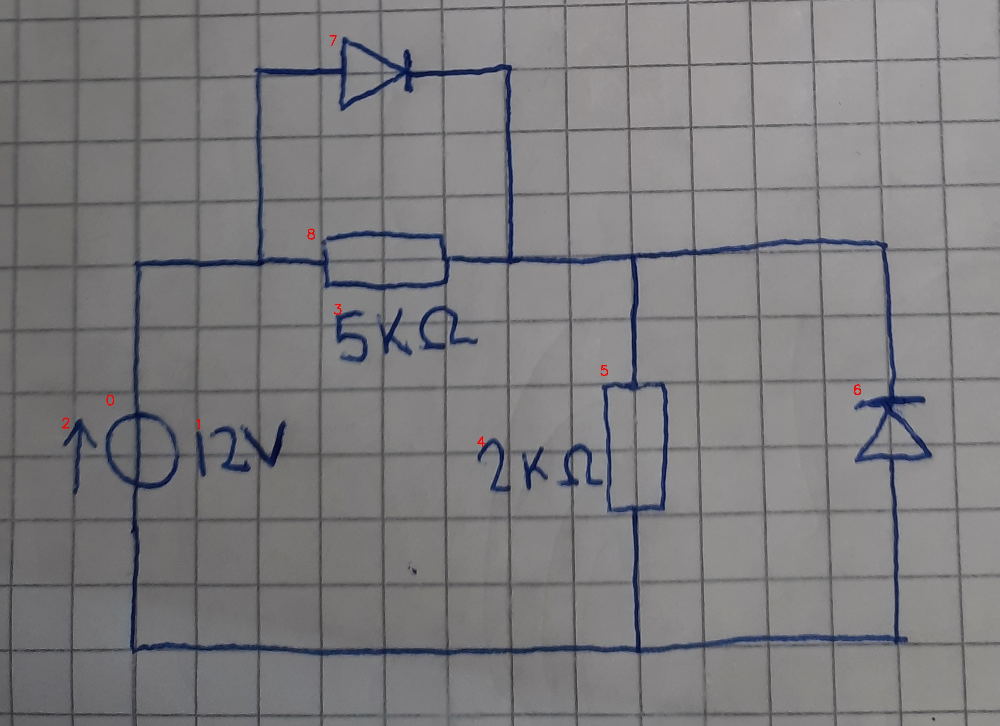

# 25_00_c_a_eval.jpg

always \<left right> or \<top bottom>

## START

	0 0 1 1 2 2 3 3 4 4 5 5 6 6 7 7 8 8
	1 0 0 0 0 0 0 0 0 0 0 0 0 0 1 0 1 0 // 0t,8l,7l
0 0 0 0 0 0 0 0 0 0 1 0 1 0 0 1 0 1 // 7r,8r,5t,6t
0 1 0 0 0 0 0 0 0 0 0 1 0 1 0 0 0 0 // 6b,5b,0b

## END

            