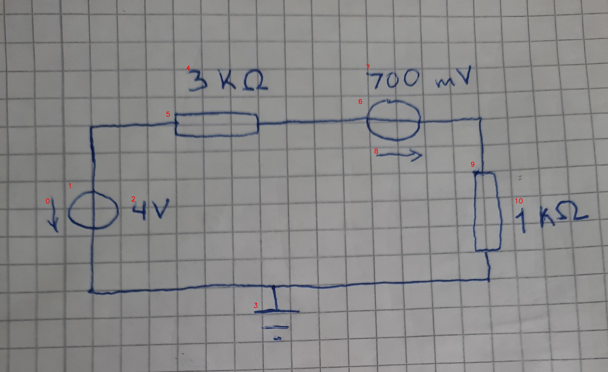

# 25_01_c_a_eval.jpg

always \<left right> or \<top bottom>

## START

	0 0 1 1 2 2 3 3 4 4 5 5 6 6 7 7 8 8 9 9 10 10
	0 0 1 0 0 0 0 0 0 0 1 0 0 0 0 0 0 0 0 0 0 0 // 1t,5l
0 0 0 0 0 0 0 0 0 0 0 1 1 0 0 0 0 0 0 0 0 0 // 5r,6l
0 0 0 0 0 0 0 0 0 0 0 0 0 1 0 0 0 0 1 0 0 0 // 6r,9t
0 0 0 1 0 0 1 0 0 0 0 0 0 0 0 0 0 0 0 1 0 0 // 9b,3t,1b

## END

            