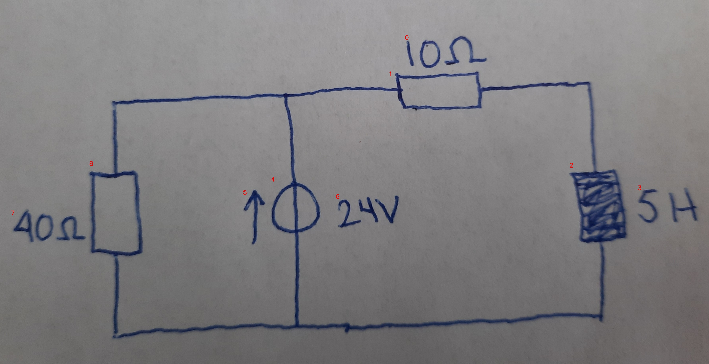

# 25_02_a_eval.jpg

always \<left right> or \<top bottom>

## START

	0 0 1 1 2 2 3 3 4 4 5 5 6 6 7 7 8 8
	0 0 1 0 0 0 0 0 1 0 0 0 0 0 0 0 1 0 // 8t,4t,1l
0 0 0 1 1 0 0 0 0 0 0 0 0 0 0 0 0 0 // 1r,2t
0 0 0 0 0 1 0 0 0 1 0 0 0 0 0 0 0 1 // 2b,4b,8b

## END

            