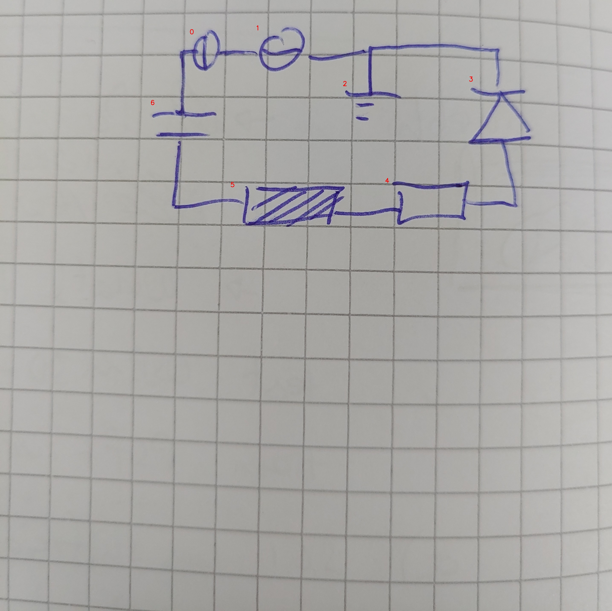

# 26_01_c_eval.jpg

always \<left right> or \<top bottom>

## START

	0 0 1 1 2 2 3 3 4 4 5 5 6 6
	0 1 1 0 0 0 0 0 0 0 0 0 0 0 // 0r,1l
0 0 0 1 1 0 1 0 0 0 0 0 0 0 // 1r,2t,3t
0 0 0 0 0 0 0 1 0 1 0 0 0 0 // 3b,4r
0 0 0 0 0 0 0 0 1 0 0 1 0 0 // 4l,5r
0 0 0 0 0 0 0 0 0 0 1 0 0 1 // 5l,6b
1 0 0 0 0 0 0 0 0 0 0 0 1 0 // 6t,0l

## END

            