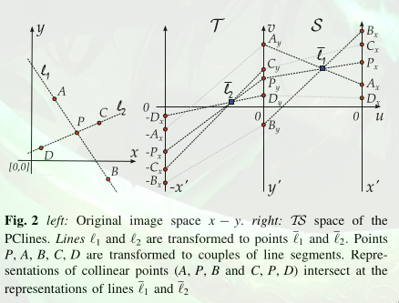
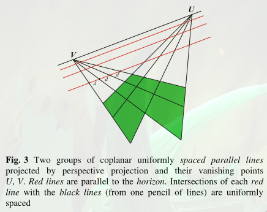
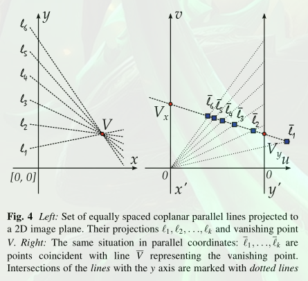
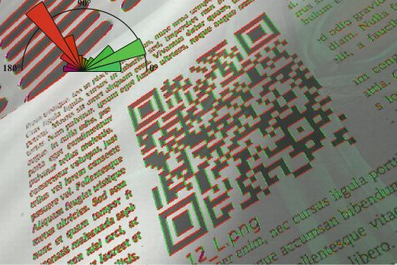
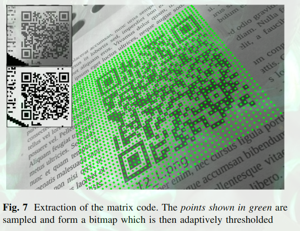

# Paper summary

## 1. [Real-time precise detection of regular grids and matrix codes](qr_dmc_pclines.pdf)

### 1.1 Task

Detect a skewed, rotated, scaled DMC / QRCode

### 1.2 Problem

Hough space information ignored.

### 1.3 Idea

Vanishing points behave differently in the PCLine space (intersections of lines). So instead of computing Hough Transform and find vanishing points, find vanishing points directly in PCLine space.

### 1.4 Solution

Find vanishing points through intersections of lines in the PCLine space.

Grid with two vanishing points and parallel lines

Representation in PCLine space. Vanishing point is now a line. Intersection of lines on the now Vanishing Line can be used to reproduce the grid in the real image.

Algorithm

1. Perform edge detection
    1. Remove noise by thresholding low gradients
1. Compute histogram with main edge orientations
1. Select edges + neighbors where 90°
1. Select E best edges with highest gradient (avoids fine tuning threshold)
    1. E selected proportional to image size

### 1.5 Results

### 1.6 My application

Extract the grid.

Problem: How to not extract the circuit if it is drawn exactly on the grid?

## Template header

### Task

bla

### Problem

bla

### Solution

bla

### Results
