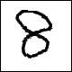
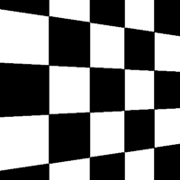
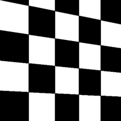
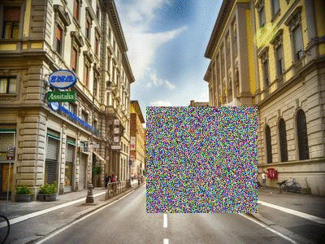

# Current Missing Augmentations in Darknet

## Current State

- random cropping
- random rotation
- flip
- saturation
- exposure
- hue
- mosaic
- cutout
- mixup

## Missing

- elastic distortions

- tilt

- skew

- shear

- cropped rotations (rot without zero-pad)

- random erase

- project circuit on different backgrounds (e.g. table)

Problems: some are changing the bbox values (find smth, or implement it)

# General Ideas

- TTA: DONE

- derotation layer? Predict the rotation of the class? => allow any rotation
    - segmentation easily trained on all rotations

# Next steps

1. unet
1. yolo-tf, augmentations
1. profit

# Grid detection (optional)

## Idee 1

- Grid und Zeichnung sind sich sehr ähnlich
- Finde Zeichnungs Farbe indem man sich dominante Farben in Bounding Box anschaut?
- BUT Zeichnung hat gleiche Farbe => fucked
j
- Canny edge findet grid und Zeichnung
- Canny Maske nutzen um richtige colors aus dem Image zu extrahieren
- Thresholden mit gefundenen Farben

## Idee 2

- wieder Farben in Bboxen anschauen
- 3 Cluster verwenden? (white, grid, circuit)
- dynamisch Canny threshold ermitteln Grid fällt dann durch

# Idee 2.1

- gradient innerhalb von boundingboxen berechnen => daraus canny th ableiten
- RESULTS:
    - funktioniert in 50% der Fälle
    - abhängig von der stärke des blurs
        - vll blur größe finden basierend auf ???

## Idee 3

- template matching (somehow)
- mit ORB (findet jedoch keine Punkte im Grid)

## Idee 4

- Hough lines finden
- lines = [*perpendicular_lines, *parrallel_lines]
- PROBLEME: rauschen von nicht gecropten Bildern
- guten Winkelthreshold für Parallelität

# Idee 5

- unet biatch
- mobile unet als erstes trainieren (inspired by mobilenet)

## Idee 6

- fit squares, rebuild the pattern, and exclude it

## Idee 7

- fit a template pattern with regression?

# Idee 8

- pclines qr code detection
- problems: How to not erase the wire
