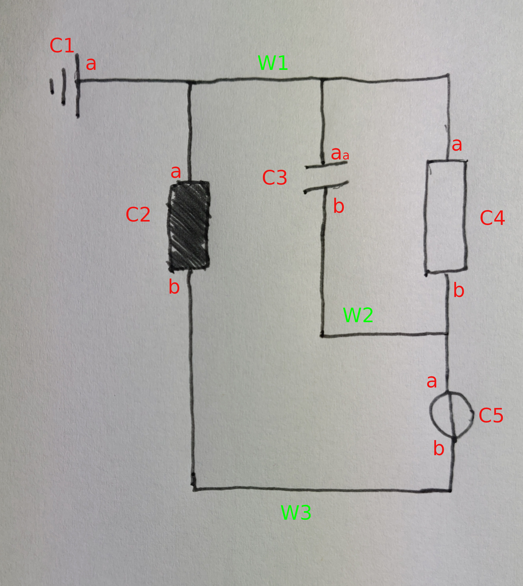

# MA Metric

## Error Sources

- Component: FP / FN
- AnnotationDetection: FP/ FN
- AnnotationMapping: FP / FN?
- Topology: FP / FN

## Topology

    - 5 Components
    - 3 Wires

    Topology

    connector | connectees
    W1        | C1a(Gr) & C2a(Res) & C3a(Cap) & C4a(Res)
    W2        | C3b(Cap) & C4b(Res) & C5a(Vol)
    W3        | C2b(Res) & C5b(Vol)

## Predefined Metric File to Compare to

W1 is arbitrary. Wires won't really be mapped. Only necessary
thing is that all components connected to a wire are connected
to the same wire!

    LabelFile:
    /////////////////////////////
    bbox_1 label_1
    ...
    bbox_n label_n
    /////////////////////////////

    MetricFile:
    /////////////////////////////
    W1: bbox_idx_n | bbox_idx_m
    ...
    /////////////////////////////

    How to compare TRUE == PRED

    // THRESH already sucks because e.g. ground has sometimes IoU < 0.5
    // and will still result in a correct topology output, but would then be
    // unmappable
    // => component wise adaptive THRESH

    I:   IoU(bbox_idx_n_TRUE, bbox_idx_n_PRED) > THRESH
    II:  IoU(bbox_idx_m_TRUE, bbox_idx_m_PRED) > THRESH
    III:

    idx  | iou matches | class matches
    -----------------------------------
    idx1 |     +       |      +
    idx2 |     +       |      -
    idx3 |     -       |      -  (class can't match then)

    // this is only true when also the connected components
    // correctly detects connections, which is essentially bound to
    // the segmentation
    w1: idx1, idx2   // indices correct, idx2 class not matching
    w2: idx2, idx3   // idx2 correct, idx3 false
    w3: idx3, idx1   // idx3 false, idx1 correct

## Macro: F1 / Accuracy

- DOESN'T WORK WITHOUT USING SPATIAL INFORMATION IN THE GRAPH

- considers only topology
- FP: when component is present where it shouldn't be
- FN: absence of component in graph
=> When a conectee is wrongly classified it will be wrong inside of two connectors
=> Ignore that
=> Hence just split up everything?

## Micro F1

## Seperate

- YOLO: mAP
- UNet: mIOU / Jaccard
-

## Pipeline

- detect component
- detect annotation
- map annotation to component
- detect topology

## General on Metrics

- Accuracy used when TP & TN more important
- F1 used when FP & FN more important
